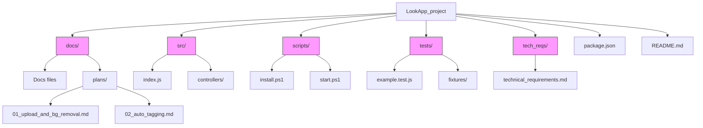

Cel: szczegółowy opis struktury tego repozytorium LookApp oraz praktyczne wskazówki uruchamiania i utrzymania.
14) Graficzna struktura projektu
Poniżej znajduje się graficzna reprezentacja głównych katalogów i istotnych plików w repozytorium (Mermaid):

# Files_Structure

Cel: szczegółowy opis struktury tego repozytorium LookApp oraz praktyczne wskazówki uruchamiania i utrzymania.
1) Główne pliki
- `index.js` — prosty HTTP server używany jako lokalny entrypoint dla MVP.
- `package.json` — zależności i skrypty (m.in. `start`, `dev`, `install:windows`, `start:windows`).
2) Kluczowe katalogi i ich zawartość
- `docs/` — dokumentacja projektowa i procesowa:
  - analizy i strategie (`Competitor_audit_LookApp.md`, `GTM_Strategy.md`)
  - `plans/` — opis funkcjonalności i roadmapa
3) Zalecane katalogi kodu (dla przyszłego rozwoju)
- `src/` — kod źródłowy (zalecana struktura: `src/controllers`, `src/services`, `src/models`, `src/utils`).
- `tests/` — testy jednostkowe/integracyjne; `tests/fixtures` dla danych testowych.
4) Konwencje i praktyki
- Język: angielski dla nazw katalogów i technicznych plików (`docs`, `src`, `tests`).
- Nazwy plików: preferowane `kebab-case` dla dokumentacji i skryptów; techniczne zasady zapisujemy w `CONTRIBUTING.md`.
5) Uruchomienie lokalne (ważne komendy)
Windows (PowerShell):
```
npm run install:windows
npm run start:windows
```
6) Szablon `README.md` dla katalogu
- Purpose: krótki opis celu katalogu
- Important files: lista najważniejszych plików
7) Zasady dla agenta przygotowującego opis struktury dokumentów
- Cel: dostarczyć jednolitą procedurę, której agent będzie przestrzegać przy generowaniu opisów struktury repozytorium i katalogów.
- Krok 1 — Skan repozytorium: zebrać listę plików i katalogów na najwyższym poziomie oraz przejrzeć `docs/`, `scripts/`, `tech_reqs/` i inne istotne katalogi.
8) Weryfikacja i odpowiedzialność
- Przypisz właścicieli katalogów w `CODEOWNERS` lub w `docs/` (np. kto odpowiada za `docs/`, `scripts/`, `tech_reqs/`).
- Przy code review sprawdzaj spójność opisu i aktualność dokumentacji.
9) Gdzie szukać dalszych informacji
- Szczegółowe zasady i checklisty: [docs/workflows/WF_Files_Structure.md](docs/workflows/WF_Files_Structure.md)
- Wymagania techniczne: [tech_reqs/technical_requirements.md](tech_reqs/technical_requirements.md)
# Files_Structure

Cel: szczegółowy opis struktury tego repozytorium LookApp oraz praktyczne wskazówki uruchamiania i utrzymania.

 1) Główne pliki w repozytorium
- `index.js` — prosty HTTP server (lokalny entrypoint dla MVP). Uruchamiany przez `npm start`.
- `package.json` — zależności i skrypty (m.in. `start`, `dev`, `install:windows`, `start:windows`).
- `README.md` — dokumentacja wysokiego poziomu projektu i linki do szczegółowych dokumentów w `docs/`.

 2) Struktura katalogów (szczegóły)
- `docs/` — dokumentacja projektowa:
  - `Competitor_audit_LookApp.md`, `GTM_Strategy.md`, `ICP_Persona_LookApp.md` itd. — analiza, strategie i wymagania biznesowe.
  - `plans/` — opis funkcjonalności i planów rozwoju (kolejne kroki MVP).
  - `workflows/` — wzorce i wytyczne (np. `WF_Files_Structure.md`).
  - `rules/` — zasady projektowe i notatki.
- `scripts/` — skrypty pomocnicze (PowerShell):
  - `install.ps1` — instalacja zależności na Windows (wywoływane przez `npm run install:windows`).
  - `start.ps1` — uruchamia `node index.js` (wywoływane przez `npm run start:windows`).
- `tech_reqs/` — techniczne wymagania i rekomendacje architektury (`technical_requirements.md`).

 3) Zalecane katalogi kodu (jeśli dodawane)
- `src/` — kod źródłowy aplikacji (jeżeli projekt się rozrośnie). Zalecana struktura: `src/controllers`, `src/services`, `src/models`.
- `tests/` — testy jednostkowe i integracyjne, z `tests/fixtures` dla danych testowych.
- `config/` lub `configs/` — pliki konfiguracyjne środowiskowe (przykłady: `config.default.json`, `.env.example`).

 4) Konwencje i praktyki stosowane w tym repo
- Język nazw katalogów: angielski (np. `docs`, `scripts`, `tech_reqs`).
- Nazwy plików: preferowane `kebab-case` dla plików dokumentacji i skryptów; techniczne konwencje można zapisać w `CONTRIBUTING.md`.
- Sekrety i konfiguracje: NIE przechowujemy sekretów w repo — dodaj `.env.example` z opisem zmiennych środowiskowych.
- Duże pliki i binaria: nie trzymamy w repo (użyć LFS lub zewnętrznego storage); w `docs/` opisz sposób ich pozyskiwania.
- Testy: struktura `tests/` powinna odpowiadać `src/` (łatwiejsze mapowanie test → implementacja).

 5) Jak uruchomić projekt lokalnie (Windows i cross-platform)
- Windows (PowerShell):
  - `npm run install:windows` — uruchamia `scripts/install.ps1`.
  - `npm run start:windows` — uruchamia `scripts/start.ps1` (uruchamia `node index.js`).
- Cross-platform (Node/npm):
  - `npm ci` lub `npm install` — zainstaluje zależności.
  - `npm run dev` — uruchamia `nodemon index.js` (środowisko deweloperskie).
  - `npm start` — uruchamia produkcyjne `node index.js`.

 6) Skrypty w `package.json` (istotne)
- `start`: `node index.js` — prosty serwer dla MVP.
- `dev`: `nodemon index.js` — tryb deweloperski z autoreloadem.
- `install:windows`: uruchamia `scripts/install.ps1`.
- `start:windows`: uruchamia `scripts/start.ps1`.

 7) Właściciele, przegląd i zmiany struktury
- Przypisz właścicieli katalogów w `CODEOWNERS` lub w `docs/` (np. kto odpowiada za `docs/`, `scripts/`, `tech_reqs/`).
- Zmiany większe niż 1 poziom katalogów wymagają PR z opisem migracji i listą wpływów na CI/build.

 8) Szablon README dla katalogu (użyj go tworząc nowe katalogi)
- Purpose: krótki opis celu katalogu
- Important files: lista najważniejszych plików
- How to run: komendy do lokalnego uruchomienia/testów
- Notes: uwagi dot. konwencji i zależności

 9) Gdzie szukać dalszych informacji
- Szczegółowe zasady i checklisty: [docs/workflows/WF_Files_Structure.md](docs/workflows/WF_Files_Structure.md)
- Wymagania techniczne: [tech_reqs/technical_requirements.md](tech_reqs/technical_requirements.md)
- Strona główna projektu: [README.md](README.md)

10) `CODEOWNERS` — szablon i przykładowe przypisania
- Cel: przypisywać właścicieli katalogów, ułatwiać review i automatyzować przypisywanie reviewerów.
Przykładowa zawartość pliku `CODEOWNERS` (dostosuj do rzeczywistych GitHub handle):
```
# Przykładowe przypisania (zastąp placeholdery prawdziwymi GH handle)
/docs/ @zuzia-gh
/scripts/ @zofia-gh
# Domyślny fallback (odkomentuj i dostosuj):
# * @org/team
```

11) `CONTRIBUTING.md` — pełna treść (wklejona jako referencja)
- Cel: jasno określić konwencje, workflow PR i instrukcje uruchomienia.

CONTRIBUTING (skondensowana treść):
- Konwencje nazewnictwa
  - Katalogi i techniczne pliki: angielski (np. `src`, `docs`, `tests`).
  - Pliki dokumentacji i skrypty: preferowane `kebab-case`.
- Commity i PR
  - Commit messages: krótkie podsumowanie + (opcjonalnie) szczegóły w opisie.
  - PRy: zawrzyj opis zmian, wpływ na CI oraz kroki migracji jeśli zmieniasz strukturę katalogów >1 poziom.
- Struktura katalogów i README
  - Każdy ważniejszy katalog powinien mieć `README.md` z: Purpose, Important files, How to run, Notes.
- Uruchomienie lokalne
  - Windows (PowerShell): `npm run install:windows` then `npm run start:windows`
  - Cross-platform: `npm ci` then `npm run dev`
- Testy
  - Umieszczaj testy w `tests/` z mirrorową strukturą do `src/`.
  - Dane testowe w `tests/fixtures`.
- Bezpieczeństwo
  - Nie dodawaj sekretów do repo. Użyj `.env.example` jako wzorca.
- CODEOWNERS
  - Zaktualizuj `CODEOWNERS` aby przypisać właścicieli katalogów.

12) Szkielet `src/` i `tests/` — lista utworzonych plików i przykłady treści
- Cel: zapewnić gotowy punkt startowy dla deweloperów.

Utworzone pliki (lokalizacja i krótki opis):
- `src/index.js` — minimalny entrypoint (skeleton):
```js
// src/index.js
const http = require('http');
const port = process.env.PORT || 3000;
const server = http.createServer((req, res) => {
  res.writeHead(200, { 'Content-Type': 'text/plain' });
  res.end('LookApp skeleton running\n');
});
server.listen(port, () => console.log(`Server running on port ${port}`));
```

- `src/controllers/README.md` — wskazówki dotyczące umiejscowienia kontrolerów (auth, looks itp.).
- `tests/example.test.js` — prosty test pokazowy (uruchamiany przez `node tests/example.test.js`):
```js
const assert = require('assert');
function sum(a, b) { return a + b; }
assert.strictEqual(sum(2, 3), 5);
console.log('example.test.js: OK');
```
- `tests/fixtures/sample.json` — przykładowy fixture JSON (strukturę zobacz w pliku).

13) Propozycje następnych kroków
- Zaktualizować `package.json` aby `npm test` uruchamiało przykładowe testy (`node tests/example.test.js`).
- Uzupełnić `CODEOWNERS` rzeczywistymi GitHub handle'ami.